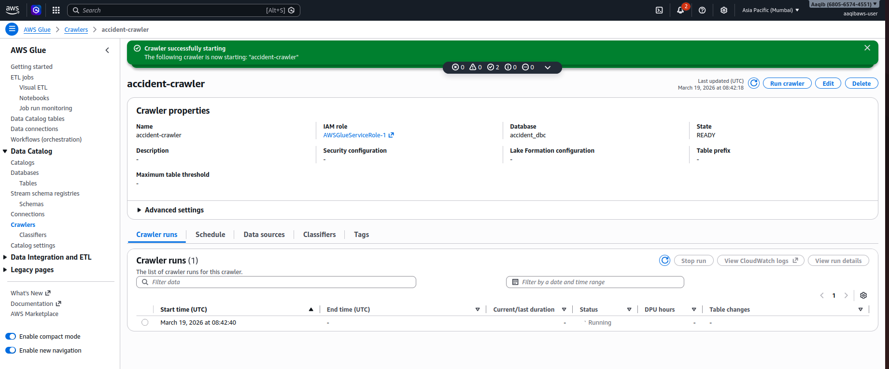
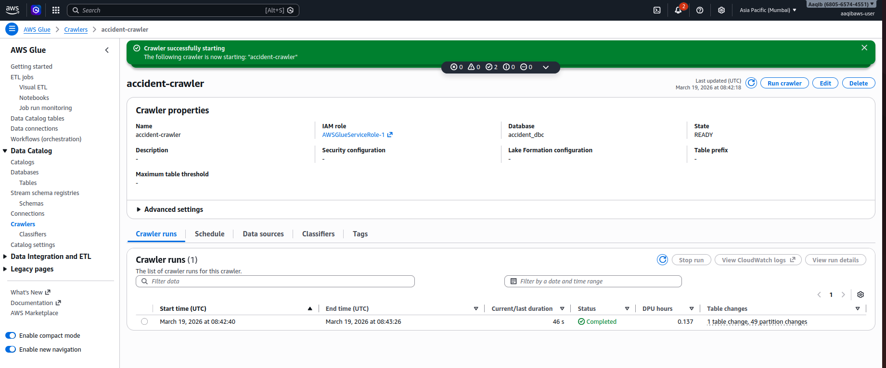
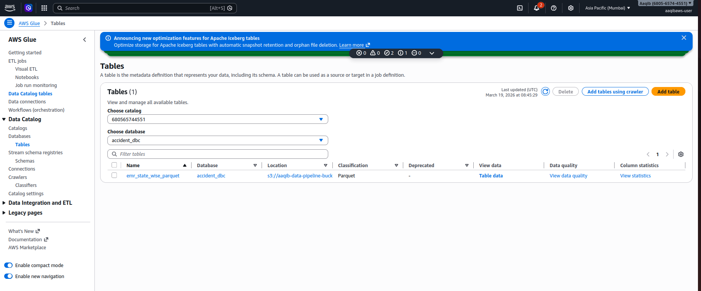
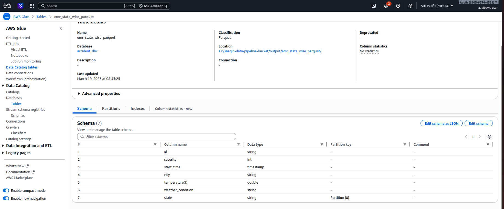
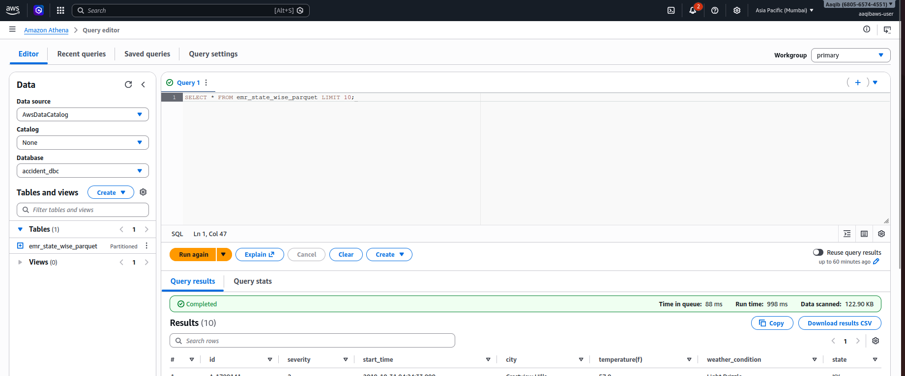
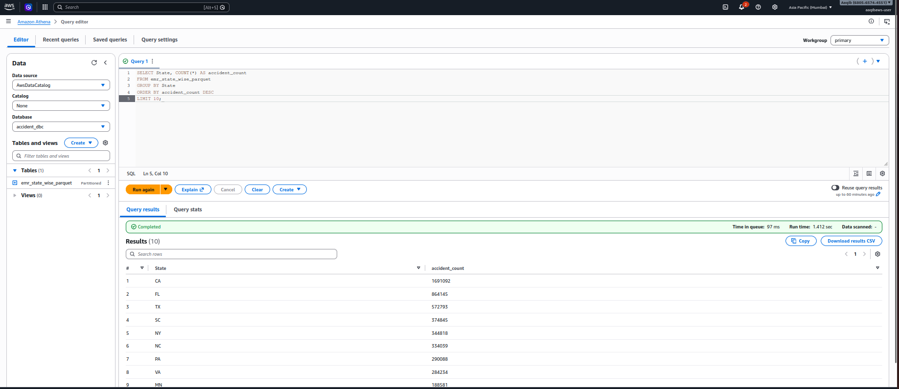
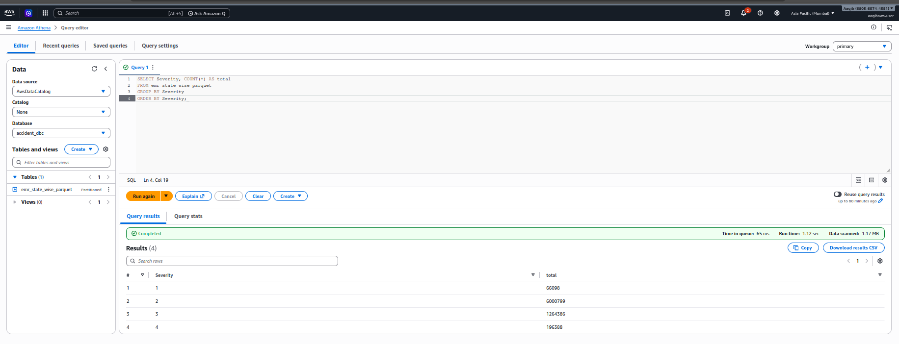

# Cloud Data Pipeline using AWS (S3, EMR, Glue, Athena)

## Project Overview
This project demonstrates an **end-to-end cloud data pipeline** built on AWS using Apache Spark.
Raw accident data is stored in Amazon S3, processed using PySpark on EMR, cataloged using AWS Glue, and queried using Amazon Athena.

## Architecture
S3 (Raw Data) → EMR (Spark Processing) → S3 (Parquet Output) → Glue (Crawler & Data Catalog) → Athena (SQL Query)

## Dataset
- **Name:** US Accidents Dataset
- **Size:** ~2.9 GB
- **Records:** ~7.7 million

## Project Structure

```
data_sets/        → raw dataset (local backup)
scripts/          → PySpark scripts
output/           → processed data (local)
queries/          → analysis queries
docs/
└── screenshots/
    ├── s3/
    ├── emr/
    │   ├── setup/
    │   └── execution/
    ├── glue/
    └── athena/
```

## Technologies Used

- AWS S3
- AWS EMR (Apache Spark)
- AWS Glue (Crawler & Data Catalog)
- AWS Athena
- PySpark
- Python
- Linux (Ubuntu)

---

## Data Pipeline Flow

### 1. Data Ingestion (S3)
- Uploaded raw dataset to Amazon S3

### 2. Data Processing (EMR)
- Created EMR cluster with Apache Spark
- Processed data using PySpark
- Cleaned and transformed dataset

### 3. Data Storage (S3)
- Stored processed data in **Parquet format**
- Partitioned by **state**

### 4. Data Cataloging (Glue)
- Created Glue Crawler
- Crawled S3 processed data
- Automatically generated table schema

### 5. Data Querying (Athena)
- Queried processed data using SQL
- Enabled serverless analytics

## Analysis Performed

- Top states with most accidents
- Accident severity distribution
- Weather condition analysis
- Top cities with most accidents
- Accidents by hour

## Screenshots

### S3
  


### EMR
  


### Glue
  
  
  


### Athena




## Sample Query

```sql
SELECT * FROM emr_state_wise_parquet LIMIT 10;
```

## Key Learnings

* Built an end-to-end AWS data pipeline
* Hands-on experience with EMR and Spark
* Understood Glue Crawlers and Data Catalog
* Queried large datasets using Athena

---

## Future Enhancements

* Load data into Amazon Redshift
* Build dashboards using BI tools
* Automate pipeline using workflows

---

## Conclusion

This project demonstrates how to build a scalable, serverless data pipeline using AWS services for big data processing and analytics.

